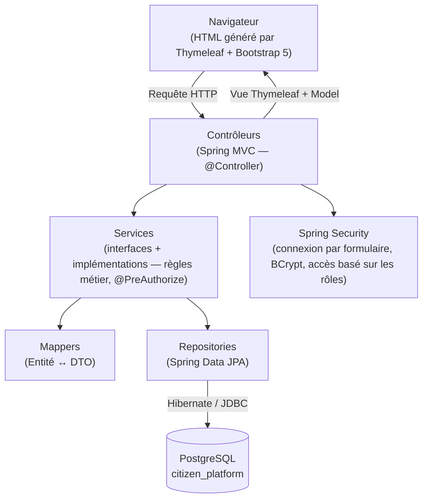

# CitizenConnect — Plateforme de gestion des réclamations et demandes de service citoyennes

Une application web full-stack Spring Boot / Java 21 qui permet aux citoyens
de soumettre et suivre des réclamations de service, aux agents de les
traiter, et aux administrateurs de gérer les utilisateurs, les catégories et
les statistiques de la plateforme

---

## 1. Vue d'ensemble

| | |
|---|---|
| **Rôles** | `ROLE_ADMIN`, `ROLE_AGENT`, `ROLE_CITIZEN` |
| **Entité centrale** | `Complaint` (réclamation), qui évolue selon `NEW → IN_PROGRESS → WAITING → RESOLVED → CLOSED` (ou `REJECTED`) |
| **Citoyens** | s'inscrivent, se connectent, soumettent des réclamations avec pièces jointes, suivent leur statut, reçoivent des notifications, modifient leur profil |
| **Agents** | consultent les réclamations qui leur sont assignées, mettent à jour le statut, ajoutent des commentaires, clôturent les réclamations |
| **Administrateurs** | gèrent les utilisateurs, les rôles, les catégories, les réclamations, et consultent les statistiques de la plateforme |

## 2. Stack technique

**Backend** — Java 21, Spring Boot 4.0, Spring MVC, Spring Data JPA
(Hibernate 7), Spring Security 7, **PostgreSQL 17**, Lombok, Maven.

**Frontend** — Thymeleaf, HTML5, CSS3, Bootstrap 5, JavaScript natif.

## 3. Architecture

Architecture MVC classique en couches — chaque couche ne communique qu'avec
celle du dessous :



- **`controller/`** — un contrôleur par ressource (`ComplaintController`,
  `UserController`, `DashboardController`, …) ; résout les noms de vues
  Thymeleaf et alimente le `Model`.
- **`service/interfaces` + `service/implementations`** — logique métier,
  vérifications de propriété (un citoyen ne peut voir que *ses propres*
  réclamations), et règles `@PreAuthorize` au niveau des méthodes.
- **`mapper/`** — conversion Entité ↔ DTO écrite à la main (pas de
  MapStruct).
- **`repository/`** — interfaces Spring Data JPA, une par entité.
- **`entity/`** — modèle de domaine mappé en JPA.
- **`security/`** — `SecurityConfig`, `CustomUserDetailsService`,
  `CustomUserDetails`.
- **`dto/` / `validation/`** — formats de requêtes/réponses ainsi que des
  contraintes Bean Validation personnalisées (`@UniqueEmail`,
  `@PasswordMatches`).
- **`exception/`** — `@ControllerAdvice` centralisé → pages d'erreur `403` /
  `404` / `500`.

## 4. Structure du projet

```
citizen-complaint-platform/
├── pom.xml
└── src/main/
    ├── java/com/company/platform/
    │   ├── PlatformApplication.java
    │   ├── config/            # WebConfig, DataInitializer (initialisation des données)
    │   ├── security/          # SecurityConfig, CustomUserDetails(Service)
    │   ├── controller/        # Contrôleurs Spring MVC
    │   ├── service/
    │   │   ├── interfaces/
    │   │   └── implementations/
    │   ├── repository/        # Repositories Spring Data JPA
    │   ├── entity/             # Entités JPA
    │   ├── dto/                # DTOs de requête/réponse
    │   ├── mapper/             # Mappers Entité <-> DTO
    │   ├── exception/          # Exceptions personnalisées + @ControllerAdvice
    │   ├── validation/         # Contraintes Bean Validation personnalisées
    │   └── util/               # FileStorageUtil, SecurityUtil
    └── resources/
        ├── application.properties
        ├── db/schema.sql        # schéma SQL de référence autonome (PostgreSQL)
        ├── db/data.sql          # données d'exemple de référence autonomes
        ├── static/css/style.css
        ├── static/js/scripts.js
        └── templates/           # Vues Thymeleaf (Bootstrap 5)
```

## 5. Schéma de la base de données

Entités : `User`, `Role`, `Complaint`, `Category`, `Comment`, `Attachment`,
`Notification`. Relations : `User ↔ Role` (plusieurs-à-plusieurs),
`User → Complaint` (citoyen et agent assigné), `Category → Complaint`,
`Complaint → Comment`, `Complaint → Attachment`, `User → Notification`.

L'application **crée et initialise automatiquement** le schéma au premier
lancement — voir [Installation](#6-installation--exécution-de-lapplication)
ci-dessous. `db/schema.sql` et `db/data.sql` sont fournis comme scripts de
référence autonomes (syntaxe PostgreSQL : `BIGSERIAL`, `TIMESTAMP`,
`ON CONFLICT ... DO UPDATE`) si vous préférez gérer le schéma manuellement.

## 6. Installation & exécution de l'application

### Prérequis
- JDK 21
- Maven 3.9+
- PostgreSQL 16/17 en cours d'exécution localement (ou accessible)

### 6.1 Créer la base de données

```bash
createdb citizen_platform
```

Il suffit ensuite de démarrer l'application (voir ci-dessous) ; Hibernate
crée automatiquement toutes les tables
(`spring.jpa.hibernate.ddl-auto=update`) et `DataInitializer` initialise les
rôles, les comptes par défaut, les catégories, et quelques réclamations de
démonstration au premier démarrage.

Alternativement, exécutez les scripts autonomes manuellement :

```bash
psql -d citizen_platform -f src/main/resources/db/schema.sql
psql -d citizen_platform -f src/main/resources/db/data.sql
```

Si vous procédez ainsi, définissez
`spring.jpa.hibernate.ddl-auto=validate` dans `application.properties` pour
qu'Hibernate n'essaie pas de modifier votre schéma créé manuellement.

### 6.2 Configurer la connexion

Modifiez `src/main/resources/application.properties` si vos identifiants
PostgreSQL diffèrent des valeurs par défaut (authentification locale de
confiance, sans mot de passe) :

```properties
spring.datasource.url=jdbc:postgresql://localhost:5432/citizen_platform
spring.datasource.username=<votre-utilisateur-os-ou-rôle-db>
spring.datasource.password=
```

### 6.3 Exécuter

```bash
mvn spring-boot:run
```

ou construisez un jar et exécutez-le :

```bash
mvn clean package
java -jar target/citizen-complaint-platform.jar
```

L'application démarre sur **http://localhost:8080**.

## 7. Comptes par défaut

Créés automatiquement au premier lancement, et affichés en direct sur la
page de connexion (récupérés depuis la table `users` via
`demo_password_hint`, non codés en dur dans le HTML) :

| Rôle | Email | Mot de passe |
|---|---|---|
| Admin | `admin@platform.com` | `Admin@123` |
| Agent | `agent@platform.com` | `Agent@123` |
| Citoyen | `citizen@platform.com` | `Citizen@123` |

Les nouveaux citoyens peuvent également s'auto-inscrire via le lien
**Créer un compte** sur la page de connexion.

## 8. Fonctionnalités clés par rôle

**Citoyen** (`ROLE_CITIZEN`)
- S'inscrire / se connecter.
- Soumettre une réclamation : titre, catégorie, lieu, description, pièces
  jointes.
- Suivre le statut via un indicateur visuel de cycle de vie
  (`NEW → IN_PROGRESS → WAITING → RESOLVED/CLOSED/REJECTED`).
- Commenter et suivre uniquement leurs propres réclamations.
- Recevoir des notifications lors des changements de statut et des nouveaux
  commentaires d'agents.
- Modifier son profil (y compris le changement de mot de passe).

**Agent** (`ROLE_AGENT`)
- Tableau de bord listant les réclamations qui lui sont assignées.
- Mettre à jour le statut des réclamations, ajouter des commentaires,
  consulter/télécharger les pièces jointes.
- Ne peut pas accéder à la gestion des utilisateurs/rôles/catégories ni aux
  statistiques globales.

**Administrateur** (`ROLE_ADMIN`)
- CRUD complet sur les utilisateurs, rôles et catégories (`/users/**`,
  `/roles/**`, `/categories/**`).
- Consulter et gérer toutes les réclamations (assigner des agents,
  supprimer, changer le statut).
- Tableau de bord de statistiques dédié : totaux, répartition par statut et
  par catégorie, réclamations/utilisateurs récents (`/statistics/**`).

## 9. Sécurité

- Connexion par formulaire (`/login`), hachage des mots de passe avec
  BCrypt, application d'une session unique (`maximumSessions(1)`).
- Contrôle d'accès au niveau des routes (`SecurityConfig`) : `/users/**`,
  `/roles/**`, `/categories/**`, `/statistics/**` nécessitent `ROLE_ADMIN` ;
  tout le reste nécessite simplement d'être authentifié.
- `@PreAuthorize` au niveau des méthodes pour des actions plus fines, par
  exemple :
  - `@PreAuthorize("hasRole('CITIZEN')")` — créer une réclamation.
  - `@PreAuthorize("hasAnyRole('AGENT','ADMIN')")` — changer le statut /
    commenter.
  - `@PreAuthorize("hasRole('ADMIN')")` — supprimer une réclamation.
- Des vérifications au niveau objet dans la couche service garantissent
  qu'un citoyen ne peut voir que ses propres réclamations et un agent
  uniquement celles qui lui sont assignées, même en devinant une URL.
- Pages d'erreur `403` / `404` / `500` centralisées via
  `@ControllerAdvice`.

## 10. Notes pour les évaluateurs / prochaines étapes

- `spring.jpa.hibernate.ddl-auto=update` est pratique pour un projet
  académique ; passez à des migrations Flyway/Liquibase pour un déploiement
  en production réel.
- Les fichiers téléversés sont stockés sur le disque local
  (`app.upload.dir`) ; remplacez `FileStorageUtil` par un client compatible
  S3 pour évoluer au-delà d'une seule instance.
- Les contraintes Bean Validation personnalisées (`@UniqueEmail`,
  `@PasswordMatches`) dans `validation/` illustrent la couche de validation
  demandée dans le cahier des charges, en complément des annotations
  standard `@NotBlank`/`@Email`/`@Size` sur chaque DTO.
